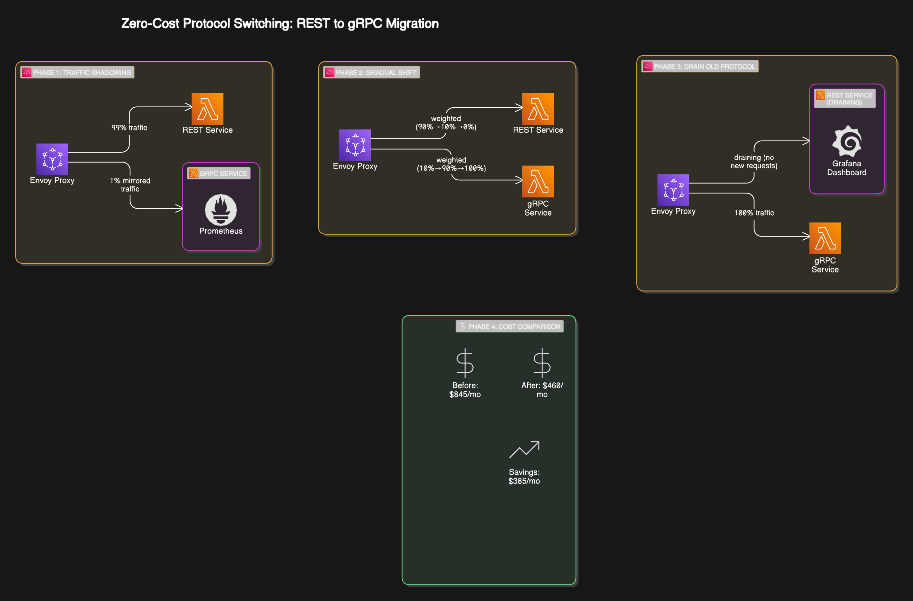
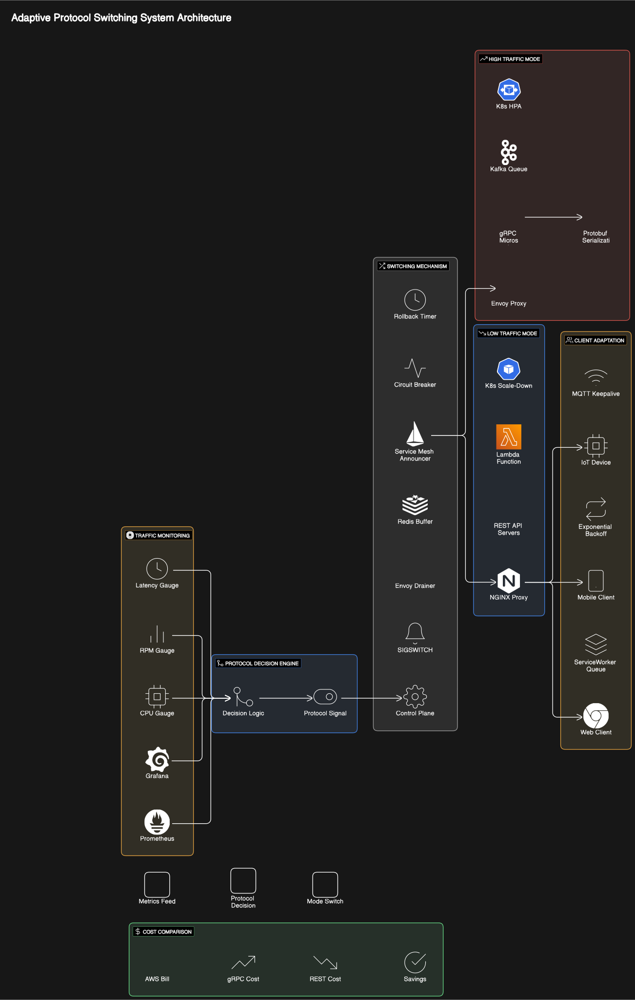

# Adaptive Protocol Switching System

**Author:** Syed Shoaib ([LinkedIn](Your LinkedIn URL) | [GitHub](Your GitHub Profile URL))
**Status:** Conceptual Exploration / Proof of Concept

---

## 🧠 Overview

This project presents a conceptual system designed to dynamically switch between REST and gRPC protocols at runtime based on system load. The goal is to reduce infrastructure costs during low-traffic periods by leveraging lighter-weight RESTful instances, and automatically transition to high-performance gRPC instances under heavier loads.

The system is intended as an intelligent, self-optimizing traffic management architecture — ideal for backend-heavy applications with unpredictable or spiky traffic.

---

## ⚙️ Core Idea

The service operates behind an intelligent proxy (e.g., **Envoy**) and routes requests based on current system metrics:

- **Low Traffic Mode:** Routes requests to REST-based instances optimized for cost (e.g., lighter compute, lower idle cost).
- **High Traffic Mode:** Routes to gRPC-based services that are optimized for throughput and performance.
- **Dynamic Switching:** Uses real-time system metrics to decide when to switch. Transitions are gracefully managed to avoid dropped connections or failed requests.

---

## 🏗️ Architecture Overview

```
+---------+       +-----------------+       +-------------------------+       +---------------------+
| Client  | ----> |   Envoy Proxy   | ----> | gRPC Service Instance(s)| <---> | Monitoring/Metrics  |
| (Web/App)|       | (Router/Switcher)| --+-> | (High Load Pool)        |       | (e.g., Prometheus)  |
+---------+       +-----------------+   |   +-------------------------+       +----------+----------+
                                        |                                                | Trigger
                                        |                                                V
                                        +-> +-------------------------+       +---------------------+
                                            | REST Service Instance(s)| ----> | Switch Coordinator  |
                                            | (Low Load Pool)         |       | (Updates Envoy Conf)|
                                            +-------------------------+       +---------------------+
```


---

## 🧩 Components Breakdown

- **🧭 Envoy Proxy:** Central router that forwards requests to REST or gRPC backends. Supports dynamic configuration via xDS APIs.
- **📊 Traffic Monitor:** Uses **Prometheus** to collect metrics like CPU usage, RPS (requests/sec), and latency.
- **🧠 Switch Coordinator:** Decision-making agent that compares metrics to defined thresholds and triggers a protocol switch.
- **🧵 Backend Service Pools:**
  - REST Pool: Scales down cheaply during idle time.
  - gRPC Pool: Optimized for speed and efficiency under load.
- **🧰 Optional Buffer/State Layer:** In a real-world version, a **Redis buffer** or similar mechanism may handle in-flight requests or stateful logic during switching.

---

## 🚦 Switching Logic Flow

1. **Monitoring:** Prometheus collects metrics from Envoy and the service pools.
2. **Threshold Evaluation:** Switch Coordinator compares metrics to defined rules (e.g., CPU > 80%, latency > 200ms).
3. **Configuration Change:** If thresholds are breached, it triggers a protocol switch via Envoy’s xDS API.
4. **Graceful Draining:** Envoy begins draining existing connections while forwarding new requests to the new protocol pool.
5. **Retry Logic (Optional):** Clients may see a temporary 503 with `Retry-After`, or retry automatically if using gRPC client libraries.

---

## 🧪 Technologies Explored

| Layer             | Tool/Tech                     | Purpose                                      |
|------------------|-------------------------------|----------------------------------------------|
| Routing           | Envoy Proxy (xDS API)         | Smart protocol-based request routing         |
| Monitoring        | Prometheus + Grafana          | Load and performance metrics collection      |
| Protocols         | REST (HTTP/1.1), gRPC (HTTP/2)| Compare cost vs. performance trade-offs      |
| Backend           | Node.js (extensible)          | Common service logic across REST/gRPC        |
| State Buffering   | Redis (Conceptual)            | Graceful transitions & retry handling        |

---

## 🧠 Key Insights & Trade-offs

| Challenge                  | Insight                                                                 |
|---------------------------|-------------------------------------------------------------------------|
| **Operational Complexity**| Significantly more moving parts than traditional autoscaling setups     |
| **Switching Latency**     | Even with xDS, switching takes time and can affect UX (~5-15ms impact)  |
| **Threshold Flapping**    | Systems must avoid constant back-and-forth via hysteresis/delays        |
| **Cost vs. Complexity**   | Autoscaling a single gRPC setup may yield similar or better savings     |
| **Use Case Scope**        | Best for niche scenarios (e.g., predictable heavy spikes, static cost tiers) |

---

## 💭 Limitations & Future Exploration

- No full-scale deployment or benchmarking conducted — conceptual POC stage.
- Failure modes (e.g., coordinator crash, missed metrics) need better fault-tolerance design.
- Could integrate ML-based predictive switching or reinforcement learning in the future.
- Advanced client SDKs could support protocol hinting, retries, or graceful failover on switch.

---

## ✅ Takeaways

This project showcases how a layered, protocol-aware architecture can dynamically respond to traffic demands for **cost-performance optimization**. It is not necessarily superior to autoscaling but opens the door to creative cloud efficiency strategies. The exercise emphasized:

- Practical trade-off evaluation over theoretical optimization
- Architectural thinking applied to real-world cloud infrastructure
- Systems-level understanding of protocol, routing, and observability tools

---

## 📂 Diagrams

### PNG Version (Visual Overview)


### SVG Version (For High-Quality Vector Usage)


---

## 📁 Repository Status

> This repository currently contains **conceptual documentation** and architectural diagrams. A basic working prototype (e.g., via Docker Compose or Kubernetes) may be added in the future for demonstration purposes.

---

## 📌 Related Skills Demonstrated

- Cloud-native system design
- Protocol performance optimization (REST vs. gRPC)
- Dynamic routing with Envoy Proxy
- Observability with Prometheus
- Infrastructure cost analysis and autoscaling trade-offs

---
